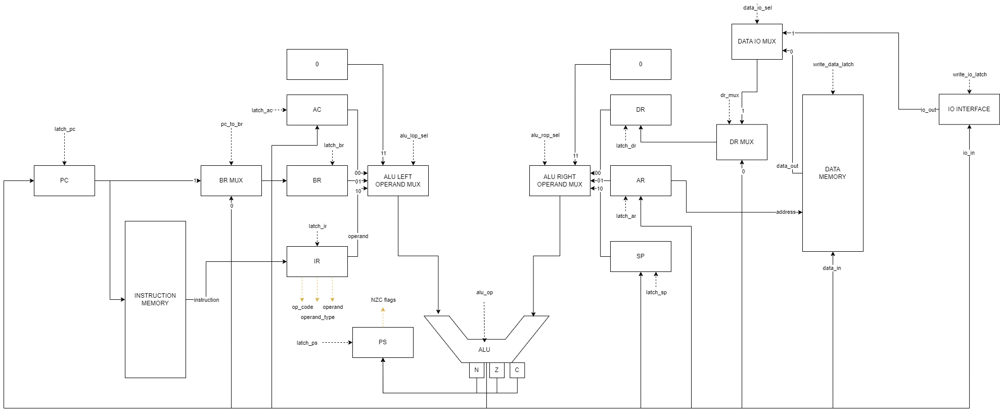

# Отчёт по лабораторной работе №3

- Выполнил: Цю Тяньшэн 
- Группа: P33312
- Вариант: `lisp | acc | harv | mc | tick | struct | stream | mem | cstr | prob5 | [4]char`

[](https://github.com/laoqiu233/comp-3/actions/workflows/python-app.yml)

## Язык программирования

По варианту необходимо реализовать LISP-подобный язык.

```bnf
<expression> ::= <*-expression> | <literal> | <identifier>
<expressions> ::= <expression> | <expression> <expressions>

<multi-expression> ::= "(" <expressions> ")"

<load-by-ptr-expression> ::= "(" "@" <identifier> ")"

<if-expression> ::= "(" "if" <expression> <if-body> ")"
<if-body> ::= <expression> | <expression> <expression>

<alloc-str-expression> ::= "(" "alloc_str" <identifier> <int-literal> ")"

<set-ptr-expression> ::= "(" "set_ptr" <identifier> <expression> ")"

<set-expression> ::= "(" "set" <identifier> <expression> ")"

<loop-while-expression> ::= "(" "loop" "while" <expression> "do" <expressions> ")"

<put-char-expression> ::= "(" "put_char" <expression> ")"
<get-char-expression> ::= "(" "get_char" ")"

<let-var> ::= "(" <identifier> <expression> ")"
<let-vars> ::= <let-var> | <let-var> <let-vars>
<let-expression> ::= "(" "let" "(" <let-vars> ")" <expressions> ")"

<math-expression> ::= "(" <math-op> <expression> <expression> ")"
<math-op> ::= ">" | ">=" | "<" | "<=" | "=" | "!=" | "+" | "-" | "<<" | ">>"

<defun-expression> ::= "(" "defun" <identifier> "(" <identifiers> ")" <expressions> ")"

<func-call-expression> ::= "(" <identifier> <expressions> ")"

<identifiers> ::= <identifier> | <identifier> <identifiers>
<identifier> ::= [a-zA-Z]+

<literal> ::= <string-literal> | <int-literal> | <bool-literal>
<string-literal> ::= "\"" [a-zA-Z]+ "\""
<int-literal> ::= [0-9]+
<bool-literal> ::= "true" | "false"

<macro> :: "#include " .+ <EOL>
```

- `let` - создать переменные на стеке, которые будут видимы внутри тела данного выражения, возвращает то - что вернуло последнее выражение в теле.
- `get_char` - выражение возвращает число от 0 до 255, которое представляет из себя следующий полученный символ из потока ввода, где 0 обозначает конец потока.
- `put_char` - помещает значение полученное в теле выражения в поток вывода
- `set` - установить для переменной значение, полученное из тела выражения
- `set_ptr` - установить по указателю для переменной значение, полученное из тела выражения
- `loop while ... do` - повторное выполняет действие в теле выражения, пока условие не станет равным 0
- `@`- возвращает значение, полученное по указателю
    - Если просто указать идентификатор, то будет загрузка по значению
- `defun` - позволяет определить функцию, работает только в глобальном скоупе, чтобы внутри выражений других не было определение функций
- `alloc_str` - позволяет аллоцировать статический буффер строковой, оптимизируя так, чтобы 4 символва помещались в одно машинное слово, работает только в глобальном скоупе
- `math-expression` - выполняет математическое действие и возвращанет результат, для вычисления сначала вычисляется правый операнд, который затем добавляется на стек, после чего вычисляется левый операнд и производится математическая операция. Для операций сравнения результат 1 или 0
- `if` - если выражение в условии отличается от 0, то возвращает первое выражение в теле, иначе второе выражение или 0, если второе выражение отсутствует
- вызов функции - помещает адрес возврата и все аргументы по очереди на стек, затем переход на адрес функции
- числовой литерал - сразу возвращает число
- строковой литерал - все строковые литералы в программе статически выделены в памяти, возвращается адрес этого литералла
- булевый литерал - становится числом 1 или 0

Память для строковых литераллов, строковых буфферов выделяется статически и их видимость глобальная. Локальные переменные создаются с помощью `let` и хранятся на стеке. 

## Организация памяти
По варианту использутется гарвардская архитектура, поэтому память инструкций и память данных разделена.

Память инструкции предствляет из себя список объектов, которые описывают инструкции. 

Память данных - линейное адресное пространство, где одно машинное слово - 32 бит. В коде реализуется словарем, чтобы не хранить все нули между началом памяти и вершиной стека.

- В языке отсутствует константы, поэтому здесь не будут описаны
- Числовые литералы напрямую загружаются в аккумулятор, когда они встречаются
- Различные строковые литералы будут по очереди статически выделены в начале памяти данных, и когда они встречаются, используется их адрес в памяти. Одинаковые строковые литералы будут переиспользоваться. По варианту, символы будут храниться компактно, т.е. в одном машинном слове 32-бит хранятся 4 символа.
- Булевые литералы превращаются в числовые, где 1 - true, а 0 - false
- Строковые буфферы также статически выделяются в памяти данных при компиляции, изначально заполнены нулями, при их встрече используется адрес начала буффера.
- При использовании выражения `let` созданные переменные будут помещены на стек, и их область видимости ограничена выражением `let`
- Функции хранятся в начале памяти инструкции по очереди, основная программа будет располлжена после всех функций

## Система команд
Особенности процессора:
- Машинное слово - 32 бит, знаковое
- Доступ к памяти данных осуществляется по адресу, который указан в инструкции
- Ввод/вывод осуществляется путем чтения и записи в определенные ячейки памяти
- Поток управления
    - CMP - позволяет установить флаги 
    - Различные инструкции по флагам будут изменять PC

Пример команды:
```json
{
    "instructions": [
            {
                "instr_index": 0,
                "op_code": "LD",
                "operand_type": "immediate",
                "operand": 0,
                "comment": "load literal 0"
            },
    ]
}
```

- `instr_index` - номер инструкции в скомпилированной программе, нужен для отладки
- `op_code` - инструкция
- `operand_type` - тип операнда 
    - `no_operand` - для отладки, по факту тоже `immediate`
    - `immediate` - загрузка числа
    - `address` - загрузка по адресу
    - `pointer_address` - косвенная загрузка по адресу в ячейке памяти
    - `stack_offset` - с вершины стека по номеру загружать
    - `pointer_stack_offset` - косвенно по ячейки в стеке
- `operand` - число/адрес/номер в стеке

### Набор инстркции
- Вычисления
    - ADD operand
    - SUB operand
    - AND operand
    - OR operand
    - SHL operand
    - SHR operand

- Доступ к памяти
    - LD opreand
    - ST address

- Работа со стеком
    - PUSH
    - POP (The popped element is discarded and not stored in ACC)

- Branching
    - CMP operand
    - JZ address
    - JNZ address
    - JB address
    - JBE address
    - JA address
    - JAE address
    - JMP address

- Управление Control Unit
    - HLT - Устанавливает флаг HLT в Control Unit

Все команды используют аккумулятор в качестве первого источника данных и хранилище результата, второй операнд может быть указан в операнде

Везде, где указан `address`, операнд будет непосредственно использован как адрес, в других командах будет чтение по адресу

## Транслятор
Транслятор состоит из трех частей:
- [Lexer](comp3/compiler/lexer.py) - разбивает исходный поток символов на токены, проверяет на самые простые ошибки по типу незакрытых скобок
- [AST](comp3/compiler/ast.py) - используя токены строит абстрактное синтаксическое дерево, проверяет синтаксис
- [Backend](comp3/compiler/backend.py) - используя AST производит упакованную программу, в которой есть все инструкции, статически выделенные данные в памяти. Используется шаблон проектирования Visitor для обхода дерева

Интерфейс командной строки:
```bash
$ poetry install
$ poetry shell
$ python -m comp3.compiler <input_file> <output_file>
```

## Модель процессора
### Data Path


Сигналы (обрабатываются за один такт, реализуются в [микрокомандах](comp3/machine/microcode.py), на схеме отображены черными пунктирными линиями):
- latch_[regs] - записать поступаемое в регистр значение в регистр
- write_io_latch - вывести символ, поступаемый в IO интерфейс, поскольку ввод/вывод посимвольный, а шины - 32 битные, IO интерфейс будет брать младшие 8 бит.
- write_data_latch - записать поступаемое в память данных значение в ячейку, указанную в регистре AR
- alu_lop_sel - Выбор левого операнда в АЛУ
- alu_rop_sel - Выбор правого операнда в АЛУ
- alu_op - выбор операции в АЛУ
    - ADD
    - SUB
    - AND
    - OR
    - SHL
    - SHR
    - INC  # Increase left operand
    - DEC  # Decrease right operand
    - NOT # Inverse of left operand
- pc_to_br - вместо значения из АЛУ, в BR будет поступать значение из PC
- data_io_sel - Сontrol Unit по адрему будет определять, брать данные из памяти или IO устройства
- dr_sel - Брать данные из памяти или из выхода АЛУ

Данные подключенные к Control Unit (желтые пунктирные линии):
- op_code
- operand
- operand_type
- Флаги:
  - Z - нулевое значение в выходе АЛУ
  - C - при сложении был перенос в 32 бит (если считать с 0)
  - N - 31 бит установлен

### Control Unit


Занимается декодированием микрокоманд

Существуют два вида микрокоманд:
- [Управляющие](comp3/machine/microcode.py#12) - отправляют сигналы
- [Ветвление](comp3/machine/microcode.py#131) - работают как одна большая формлуа логического И по входящим в Control Unit сигналы. Если результат 1, то микрокомандных счетчик принимает значение, указанное в команде. Также есть специальный вид данной команды, где игнорируются все остальные биты и происходит ветвление по результату декодера `OP_CODE`

Листинг микрокоманд:
```
0 IR <- INSTR_MEMORY (start)
1 BR <- PC
2 PC <- AluLopSel.SEL_BR AluOp.INC AluRopSel.SEL_ZERO
3 JUMP TO DECODE(OP_CODE) IF OP_CODE IN ['PUSH', 'POP', 'HLT']
4 JUMP TO 9 IF OPERNAD_TYPE IN ['pointer_address']
5 JUMP TO 12 IF OPERNAD_TYPE IN ['stack_offset', 'pointer_stack_offset']
6 DR <- AluLopSel.SEL_IR AluOp.ADD AluRopSel.SEL_ZERO (fetch_immediate_or_no_operand_or_address)
7 JUMP TO 16 IF OPERNAD_TYPE IN ['address']
8 JUMP TO 17 IF
9 AR <- AluLopSel.SEL_IR AluOp.ADD AluRopSel.SEL_ZERO (fetch_pointer_address)
10 DR <- DataIoMuxSel.SEL_DATA
11 JUMP TO 16 IF
12 DR <- AluLopSel.SEL_IR AluOp.ADD AluRopSel.SEL_SP (fetch_stack_offset)
13 JUMP TO 16 IF OPERNAD_TYPE IN ['stack_offset']
14 AR <- AluLopSel.SEL_ZERO AluOp.ADD AluRopSel.SEL_DR
15 DR <- DataIoMuxSel.SEL_DATA
16 AR <- AluLopSel.SEL_ZERO AluOp.ADD AluRopSel.SEL_DR (fetch_operand)
17 JUMP TO DECODE(OP_CODE) IF OP_CODE IN ['JZ', 'JNZ', 'JB', 'JBE', 'JA', 'JAE', 'JMP', 'ST'] (execute)
18 JUMP TO 23 IF OPERNAD_TYPE IN ['immediate', 'no_operand']
19 JUMP TO 22 IF OPERNAD_TYPE IN ['address'] OPERAND = 52
20 DR <- DataIoMuxSel.SEL_DATA
21 JUMP TO 23 IF
22 DR <- DataIoMuxSel.SEL_IO (fetch_from_io)
23 JUMP TO DECODE(OP_CODE) IF (execute2)
24 AC <- AluLopSel.SEL_ZERO AluOp.ADD AluRopSel.SEL_DR (OpCode.LD)
25 JUMP TO 67 IF
26 JUMP TO 29 IF OPERNAD_TYPE IN ['address'] OPERAND = 69 (OpCode.ST)
27 DATA <- AluLopSel.SEL_AC AluOp.ADD AluRopSel.SEL_ZERO
28 JUMP TO 67 IF
29 IO <- AluLopSel.SEL_AC AluOp.ADD AluRopSel.SEL_ZERO (st_to_io)
30 JUMP TO 67 IF
31 BR <- AluLopSel.SEL_AC AluOp.ADD AluRopSel.SEL_DR PS <- NZC(AluLopSel.SEL_AC AluOp.ADD AluRopSel.SEL_DR) (OpCode.ADD)
32 JUMP TO 42 IF
33 BR <- AluLopSel.SEL_AC AluOp.SUB AluRopSel.SEL_DR PS <- NZC(AluLopSel.SEL_AC AluOp.SUB AluRopSel.SEL_DR) (OpCode.SUB)
34 JUMP TO 42 IF
35 BR <- AluLopSel.SEL_AC AluOp.AND AluRopSel.SEL_DR PS <- NZC(AluLopSel.SEL_AC AluOp.AND AluRopSel.SEL_DR) (OpCode.AND)
36 JUMP TO 42 IF
37 BR <- AluLopSel.SEL_AC AluOp.OR AluRopSel.SEL_DR PS <- NZC(AluLopSel.SEL_AC AluOp.OR AluRopSel.SEL_DR) (OpCode.OR)
38 JUMP TO 42 IF
39 BR <- AluLopSel.SEL_AC AluOp.SHL AluRopSel.SEL_DR PS <- NZC(AluLopSel.SEL_AC AluOp.SHL AluRopSel.SEL_DR) (OpCode.SHL)
40 JUMP TO 42 IF
41 BR <- AluLopSel.SEL_AC AluOp.SHR AluRopSel.SEL_DR PS <- NZC(AluLopSel.SEL_AC AluOp.SHR AluRopSel.SEL_DR) (OpCode.SHR)
42 AC <- AluLopSel.SEL_BR AluOp.ADD AluRopSel.SEL_ZERO (math_end)
43 JUMP TO 67 IF
44 BR <- AluLopSel.SEL_ZERO AluOp.DEC AluRopSel.SEL_SP (OpCode.PUSH)
45 AR <- AluLopSel.SEL_BR AluOp.ADD AluRopSel.SEL_ZERO SP <- AluLopSel.SEL_BR AluOp.ADD AluRopSel.SEL_ZERO
46 DATA <- AluLopSel.SEL_AC AluOp.ADD AluRopSel.SEL_ZERO
47 JUMP TO 67 IF
48 BR <- AluLopSel.SEL_ZERO AluOp.ADD AluRopSel.SEL_SP (OpCode.POP)
49 SP <- AluLopSel.SEL_BR AluOp.INC AluRopSel.SEL_ZERO
50 JUMP TO 67 IF
51 HLT (OpCode.HLT)
52 JUMP TO 67 IF
53 PS <- NZC(AluLopSel.SEL_AC AluOp.SUB AluRopSel.SEL_DR) (OpCode.CMP)
54 JUMP TO 67 IF
55 JUMP TO 66 IF Z = True (OpCode.JZ)
56 JUMP TO 67 IF
57 JUMP TO 66 IF Z = False (OpCode.JNZ)
58 JUMP TO 67 IF
59 JUMP TO 66 IF N = False (OpCode.JAE)
60 JUMP TO 66 IF N = False Z = False (OpCode.JA)
61 JUMP TO 67 IF
62 JUMP TO 67 IF
63 JUMP TO 66 IF N = True (OpCode.JBE)
64 JUMP TO 66 IF N = True Z = False (OpCode.JB)
65 JUMP TO 67 IF
66 PC <- AluLopSel.SEL_ZERO AluOp.ADD AluRopSel.SEL_DR (OpCode.JMP)
67 JUMP TO 0 IF (end)
```

Запуск:
```bash
$ poetry install
$ poetry shell
$ poetry run python -m comp3.machine <input_file> [<input_stream>] [--show-statistics, --logs]
```

## Тестирование
В качестве тестов реализовано 5 алгоритмов:
- [cat](examples/cat.lisq)
- [hello](examples/hello.lisq)
- [hello_user_name](examples/hello_user_name.lisq)
- [Project Euler Problem 1](examples/euler_problem_1.lisq)
- [Project Euler Problem 5](examples/euler_problem.lisq)

Было сделано два вида тестов:
- [Unit-tests на компонент АЛУ](tests/machine/test_alu.py)
- [Golden tests на программы](tests/golden_tests)

Запуск тестов:
```bash
$ poetry install
$ poetry shell
$ make test-cov # make test чтобы запускать без вычисления тестового покрытия
```

## CI
CI был настроен для платформы GitHub:
```yaml
name: CI

on:
  push:
    branches: [ "main" ]
  pull_request:
    branches: [ "main" ]

permissions:
  contents: read

jobs:
  lint:
    runs-on: ubuntu-latest

    steps:
    - uses: actions/checkout@v4
    - name: Install poetry
      run: pip install poetry
    - name: Set up Python 3.11
      uses: actions/setup-python@v4
      with:
        python-version: "3.11"
        cache: "poetry"
    - name: Install project
      run: |
        poetry install
    - name: Lint with pylint
      run: |
        make lint
  test:
    runs-on: ubuntu-latest
    steps:
    - uses: actions/checkout@v4
    - name: Install poetry
      run: pip install poetry
    - name: Set up Python 3.1
      uses: actions/setup-python@v4
      with:
        python-version: "3.11"
        cache: "poetry"
    - name: Install project
      run: |
        poetry install
    - name: Run tests
      run: |
        make test-cov
    needs: lint
```

Используемые инструменты:
- `pylint` - утилита для проверки качества кода
- `pytest` - утилита для запуска тестов
- `poetry` - утилита для настраивания записимостей и виртуальной среды
- `make` - чтобы команды полностью не писать
- `black` - форматирование
- `isort` - сортировка импортов

Пример использования и журнал работы процессора на примере `cat`:
```bash
$ poetry install
$ poetry shell
$ make
poetry run python -m comp3.compiler examples/euler_problem.lisq output/examples/euler_problem.json
poetry run python -m comp3.compiler examples/hello.lisq output/examples/hello.json
poetry run python -m comp3.compiler examples/euler_problem_1.lisq output/examples/euler_problem_1.json
poetry run python -m comp3.compiler examples/hello_user_name.lisq output/examples/hello_user_name.json
poetry run python -m comp3.compiler examples/cat.lisq output/examples/cat.json
$ poetry run python -m comp3.machine output/examples/cat.json foo --show-statistics --logs
[Results omitted]
```

Для просмотра логов можно посмотреть в [этот](tests/golden_tests/cat.yml) файл

Пример проверки исходного кода:
```bash
$ poetry install
$ poetry shell
$ make test
========================================================================= test session starts ==========================================================================
platform darwin -- Python 3.10.13[pypy-7.3.13-final], pytest-7.4.3, pluggy-1.3.0 -- /Users/dmitritsiu/comp3/.venv/bin/python
cachedir: .pytest_cache
rootdir: /Users/dmitritsiu/comp3
plugins: cov-4.1.0, golden-0.2.2
collected 10 items                                                                                                                                                     

tests/test_golden.py::test_golden[golden_tests/cat.yml] PASSED                                                                                                   [ 10%]
tests/test_golden.py::test_golden[golden_tests/hello_user_name.yml] PASSED                                                                                       [ 20%]
tests/machine/test_alu.py::test_compliment[0-0] PASSED                                                                                                           [ 30%]
tests/machine/test_alu.py::test_compliment[1-4294967295] PASSED                                                                                                  [ 40%]
tests/machine/test_alu.py::test_compliment[52-4294967244] PASSED                                                                                                 [ 50%]
tests/machine/test_alu.py::test_alu_addition PASSED                                                                                                              [ 60%]
tests/machine/test_alu.py::test_alu_add_zero PASSED                                                                                                              [ 70%]
tests/machine/test_alu.py::test_alu_overflow_add PASSED                                                                                                          [ 80%]
tests/machine/test_alu.py::test_alu_above_or_equals PASSED                                                                                                       [ 90%]
tests/machine/test_alu.py::test_alu_below PASSED                                                                                                                 [100%]

--------- coverage: platform darwin, python 3.10.13-final-0 ----------
Name                              Stmts   Miss  Cover
-----------------------------------------------------
comp3/common/config.py                2      0   100%
comp3/common/instructions.py         59      0   100%
comp3/compiler/__init__.py           16      0   100%
comp3/compiler/ast.py               441     90    80%
comp3/compiler/backend.py           207     16    92%
comp3/compiler/lexer.py              88      9    90%
comp3/compiler/preprocessing.py       8      0   100%
comp3/machine/__init__.py            23      4    83%
comp3/machine/common.py              22      0   100%
comp3/machine/components.py         155     28    82%
comp3/machine/control_unit.py        25      1    96%
comp3/machine/datapath.py            65      1    98%
comp3/machine/microcode.py          149      8    95%
-----------------------------------------------------
TOTAL                              1260    157    88%

Required test coverage of 70% reached. Total coverage: 87.54%

========================================================================== 10 passed in 6.59s ==========================================================================
$ make format
poetry run python -m isort comp3 tests
poetry run python -m black comp3 tests
All done! ✨ 🍰 ✨
17 files left unchanged.
$ make lint
--------------------------------------------------------------------
Your code has been rated at 10.00/10 (previous run: 10.00/10, +0.00)
```

## Cтатистика по задачам
```
| ФИО        | алг             | LoC | code байт | code инстр. | инстр. | такт.  |
| Цю Тяньшэн | hello           | 3   | -         | 558         | 575    | 8007   |
| Цю Тяньшэн | cat             | 7   | -         | 21          | 58     | 804    |
| Цю Тяньшэн | hello_user_name | 14  | -         | 623         | 1773   | 23822  |
```
